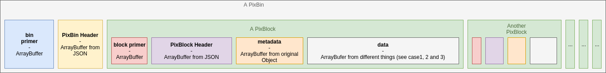
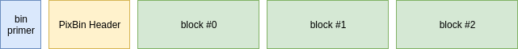
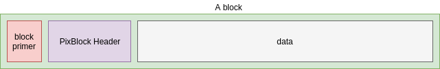

# In a word
> PixBin is a binary format that leverages the flexibility of JSON serialization and the speed of Javascript's typed arrays.

# Requirements
In order to be serialize an object into the PixBin format, it must contain:
- a `_data` attribute, no matter what it contains
- a `_metadata` attribute, no matter what it contains

**Notice:** since this format is intended to encode numerical data like pixel arrays or position arrays, the encoding the `_data` object will be optimized in the following cases:
1. `_data` is a [typed array](https://developer.mozilla.org/en-US/docs/Web/JavaScript/Typed_arrays). There is a **single stream** to encode (case 1).  
  Example:
  ```javascript
  // case 1, optimization OK
  var _data = new Float32Array(1000);
  ```
2. `_data` is an `Array` of [typed arrays](https://developer.mozilla.org/en-US/docs/Web/JavaScript/Typed_arrays). There are **several streams** to encode (case 2).  
  Example:
  ```javascript
  // case 2, optimization OK
  var _data = [ 
    new Float32Array(1000),
    new Uint16Array(500),
    new Int8Array(8000)
  ];
  ```

3. `_data` is an `Object` (or `{}`), then it will be serialized (see [Object serialization](#a-word-on-object-serialization)).  There is a **single stream** to encode (case 3).  
  Example:
  ```javascript
  // case 3, optimization not OK :(
  var _data = {
    first: "John",
    last: "Doe",
    samples: new Array(1000)
  };
  ```

The case **1** and **2** are the best for storing numerical information and the case **3** is good for storing object kind.  

**Case3 notice:**  
1. If you decide to store numerical data as some attribute of the `_data` object in case **3**, use `Array` rather than `typed arrays`. Using any of the typed arrays (`Uint8Array`, `Uint16Array`, `Float32Array`, etc. ) in **case 3** will be followed by an automatic convertion into regular `Arrays` anyway.  
2. Know that you would be limited to a maximum `_data` size of 65kBytes due to serialization limitation. If you have a big numerical dataset and a big object-based dataset it is beter to store it as two separate block.
3. If the `_data` object contains *circular reference*, they will be removed. (this is also true for `_metadata` in case 1, 2 and 3);
  

# Overview
Here is what a PixBin file looks like in the end

  
# What is the goal?
As a binary file format, the goal of the encoding is to transform every chunk of information into `ArrayBuffers`. Then, the concatenation of all these buffers into a bigger one can easily be written in a file.

# A word on object serialization
The concept of serializing data is to transform an object or a complex data structure into a linear buffer that is easy to write or stream. Fortunately, Javascript provides a universal format for that: **JSON**. But remember: PixBin is a binary format, not a text-based format, this means a JSON string is not enough and need an additional step to be encapsulated into a *pixb* file. In order to store special characters (accentuated letter, non-latin alphabet charaters, symbols and emoji) in the binary representation of `_metadata` or `_data`, buffers have to support *unicode* (2 bytes per character, while ASCII is only 1 bytes per charater).  
In this document, when we are mentioning "object serialization", it means:
- converting an object to a JSON string
- don't forget we'll have to allocate 2 bytes per character
- write every unicode charcode of the JSON string into a `Uint16Array`

**Info:** If you want to use such serialization ouside of PixBin codec, you can have a look at [CodecUtils](https://github.com/Pixpipe/codecutils), a small and handy toolbox for coding and decoding things. The method you may be interested in are `objectToArrayBuffer( obj )` and `ArrayBufferToObject( buff )`.


# The PixBin structure


It contains:
- a PixBin *primer* (blue)
- a PixBin *header* (yellow)
- one or more *blocks* (green)

The structure of each block does not rely on how they are stored within the *PixBin* or at what position.  

## The PixBin primer
- **14 bytes, 14xUint8** to encode the *magic number* which is the ASCII string `PIXPIPE_PIXBIN`. If read as ASCII charcodes, the sequence is: `80 73 88 80 73 80 69 95 80 73 88 66 73 78`.
- **1 byte, 1xUint8** to specify endianness. 0: big endian, 1: little endian
- **4 bytes, 1xUint32** to specify the byte length of the bin header

## The PixBin header
Before being serialized, the header is a JS object with attributes and values:

```javascript
{
  // The date of creation
  date: [Date],
  
  // The app that created it. Default: "pixbincodec_js" but can be changed
  createdWith: [String],
  
  // A description the user can add (optional, default: null)
  description: [String],
  
  // A JS object with further information (optional, default: null)
  userObject: this._options.userObject,
  
  // Array of block information. One element per block in the bin
  pixblocksInfo: []
}
```

`pixblocksInfo` is an Array. There are as many elements in this array as there are PixBlocks in the the PixBin. Preserving the same order, each element in `pixblocksInfo` is a quick overview of what is inside a PixBlock.

```javascript
{
  // String directly from constructor.name of the data encoded as a block.
  // This is not used for reconstruction since the same info is present in the block metadata,
  // but this can be useful in a index to know what kind of data is here without having to decode it
  type: [String],
  
  // If a block _metadata object has an attribute "description", then is copied here. (default: null)
  description: [String]
  
  // The length of the block in number of bytes
  byteLength: [Number],
  
  // The md5 checksum generated at encoding. Handy to check if file is corrupted
  checksum: [String],
}
```

The PixBin header is then serialized to be turned into an ArrayBuffer and will be stuck after the PixBin *primer*.  

As you can see, `pixblocksInfo` does not say where in the PixBin buffer start each PixBlock in term of byte offset. Though, it tells about the byte length of each of them, and since the blocks are arranged in the same order as the elements in `pixblocksInfo`, we can easily sum the `byteLength` to find the byte offset, knowing **it starts just after the PixBin header buffer**.  

# Block structure
The structure of a block is as follow:


## The PixBlock primer
- **1 byte, 1xUint8** to specify endianness. 0: big endian, 1: little endian
- **4 bytes, 1xUint32** to specify the byte length of the block header

The *primer* fits in a 5-bytes *ArrayBuffer* and it will be the very first sequence of our block (you better know the endianness before starting fetching data, right?)

## The PixBlock header
Is a buffer of *n* bytes, that contains *n/2* unicode characters (each are coded on 2 bytes). Once decoded into a unicode string, it complies to the JSON format, so that we can parse it and build a native object out of it.  
The block header contains several valuable information for how to read the data and how to interpret it:
- *byteStreamInfo*: is an array that provide a set of information for each stream to be encoded. For each stream, we have an object like that:
  ```javascript
  {
      // type is a string representing the name of the constructor of the stream
      // (ie. "Uint8Array", "Float32Array", "Object", etc. )
      type: [String],
      
      // relevant only if this stream is a typed array. True if signed, false if unsigned
      signed: [Boolean],
      
      // relevant only if this stream is a typed array. Number of byte per number in the array.
      bytesPerElements: [Number],
      
      // length of the stream in byte
      byteLength: [Number],
      
      // relevant only if this stream is a typed array. Size of the typed array
      length: [Number]
      
      // Lengthen in number of byte of the stream when/if compressed. Remain null if uncompressed
      compressedByteLength: [Number],
    }
  ```
- *originalBlockType*: the name of the object constructor (directly from `constructor.name`)
- *metadataByteLength*: the size in bytes of the serialized metadata buffer

Once the *block header* contains the information we need, it is serialized so that it's tranformed into an `ArrayBuffer`.
All the information contained in the *block header* are important to decode the *data structure*.

## the metadata
The metadata from the original object are serialized into an ArrayBuffer. Not much else to say about that, except that, for the sake of streaming, it's nevers compressed.

## The data structure
As told earlier, the *data structure* is encoded as a buffer, in Javascript, this means a `ArrayBuffer`. This array buffer can come from a *typed array* (case 1), a concatenation of *typed array* (case 2), or an object serialization (case 3).  
This buffer can be as is or compressed using *zlib* (JS port [Pako](https://github.com/nodeca/pako)). In the case of multi-array, each one is compressed independently.

## PixBlock recap
Now for each block we have:
- an ArrayBuffer for the primer (uncompressed)
- an ArrayBuffer for the header (uncompressed)
- an ArrayBuffer for the metadata (uncompressed)
- an ArrayBuffer for the data (optionaly compressed)
Great! We can put these 4 ArrayBuffers into a single big one and have a nicely packed independant block!

# All that together!
We have already covered the PixBlocks and seen that in the end, they are independant ArrayBuffers. So let's recap what happens:

